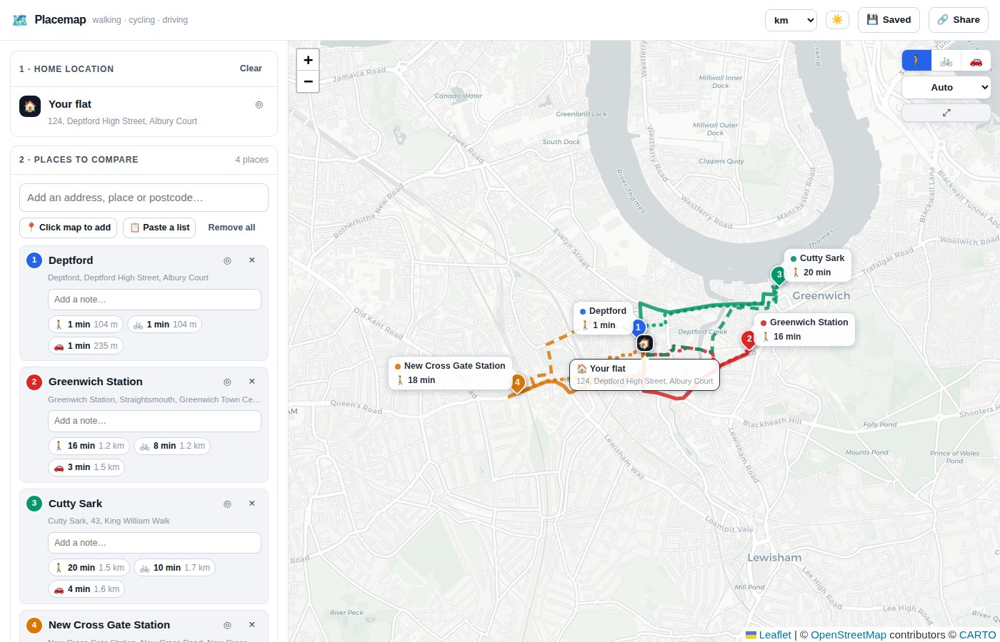
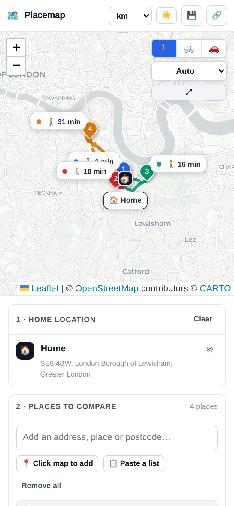

# Placemap

A custom map builder. Pick a home location, plot the places that matter, and see
**walking, cycling and driving** routes and times to every one of them at once.

Everything lives in a single self-contained `index.html` — Leaflet is inlined,
so the file has no external dependencies of its own. No build step, no server,
no API keys, no account.

## Try it

Save `index.html` and open it in a **real browser tab** — Safari, Chrome or
Firefox — or host it anywhere static (GitHub Pages, Netlify, an S3 bucket).

> **It must be a browser tab, not a preview pane.** In-app file previews,
> chat attachment viewers and embedded webviews are sandboxed and cannot make
> outside requests, so the map stays blank and address search returns nothing.
> Placemap detects this and says so on screen. Hosting it is also preferable to
> opening it from disk, because some browsers restrict `localStorage` on
> `file://` URLs, which disables the save feature.

The page needs a live internet connection in any case: tiles, address search and
routing are all remote calls.

### On a phone

iOS will not open a downloaded `.html` file in Safari — Files previews it in the
same sandbox, and `file://` URLs are blocked. Host it and open the URL instead.
This repo is laid out for GitHub Pages: `index.html` sits at the root and
`.nojekyll` is present, so enabling Pages on the default branch serves it as-is.

Once it's on a URL, Safari's **Share → Add to Home Screen** installs it as a
full-screen app.

## What it does

**Home location** — search for an address, use your device's location, or click
the map. Drag the pin to nudge it; routes recalculate automatically.

**Places** — add them one at a time:
- type an address, place name or postcode and pick from the suggestions
- arm "Click map to add" and drop as many pins as you like
- paste a whole list at once (`Label | Address` per line, or raw `lat, lon`)

Each place gets its own colour, an editable name and a free-text note. Pins are
draggable.

**Travel modes** — walking, cycling and driving are each a toggle. Every enabled
mode is drawn for *every* place simultaneously:

| | |
|---|---|
| Colour | which place the route goes to |
| Line style | dotted = walking, dashed = cycling, solid = driving |

Hover a route, a place card or a summary row and everything else dims, so a busy
map stays readable.

**Times on the map** — every pin carries a label with its travel time, fanned
outward from home so the middle of the map stays clear. Labels report **one
mode at a time**; the 🚶 🚲 🚗 buttons on the map switch which. Three times per
label becomes an unreadable pile as soon as two places sit near each other. On
a narrow screen the label drops to a coloured dot and the time, because a full
place name is half a phone wide. Toggle labels off entirely from the travel
modes panel.

**Map styles** — *Clean*, *Minimal* (no place names), *Streets* and *Dark* are
muted CARTO basemaps that let the routes carry the eye; *Detailed* is the
standard OpenStreetMap style if you want every shop and bus stop. *Auto*
follows the app's own theme.

**Theme** — light by default, whatever your device is set to. The ☀️ button in
the header cycles light → dark → match device.

**Summary table** — time and distance for every place × mode, with the quickest
mode for each place highlighted. Export it as CSV.

**Save & share** — maps are kept in `localStorage` (auto-saved, plus named saves
you can reload), exportable as a JSON file, and shareable as a link that encodes
the whole map in its fragment. Nothing is ever sent to a server of ours, because
there isn't one.

Distances switch between kilometres and miles from the header.

Routing requests that fail with a rate-limit, a 5xx or a dropped connection are
retried once; a genuine "no route" answer is not asked twice.

## Services used

All key-free and free to use:

| Purpose | Service |
|---|---|
| Map tiles | [CARTO basemaps](https://carto.com/attributions) and [OpenStreetMap](https://www.openstreetmap.org/copyright) |
| Address search / reverse geocoding | [Nominatim](https://nominatim.openstreetmap.org/) |
| Routing (foot / bike / car profiles) | [OSRM](https://project-osrm.org/) hosted by [FOSSGIS](https://routing.openstreetmap.de/) |
| Map library | [Leaflet 1.9.4](https://leafletjs.com/), BSD-2-Clause, inlined into the page |

These are volunteer-funded public endpoints, so the app plays by their rules:
geocoding requests are funnelled through a single queue spaced 1.1 s apart, and
routing requests are capped at four in flight. For heavy or commercial use,
swap in a paid provider — `MODES[].hosts` and the `NOMINATIM` constant are the
only two places that need to change.

## Troubleshooting

**Blank map, no search results.** The page can't reach the internet. Almost
always this is a sandboxed preview — open the file in a proper browser tab. The
on-screen warning names which service failed.

**"no route" in a cell.** OSRM couldn't connect that pin to the road network.
Drag the pin a few metres towards a street.

**Nothing saves between visits.** `localStorage` is unavailable, usually because
the page was opened from `file://` or in a private window. Host the file instead.

## Caveats

- Times are model estimates. There is no live traffic, and cycling times ignore
  hills and your legs.
- Routes are calculated one-way, home → place.
- OSRM occasionally can't connect a dropped pin to the road network (an island,
  a pedestrianised courtyard); those cells read "no route".

## Licence

Map data © OpenStreetMap contributors, [ODbL](https://www.openstreetmap.org/copyright).
